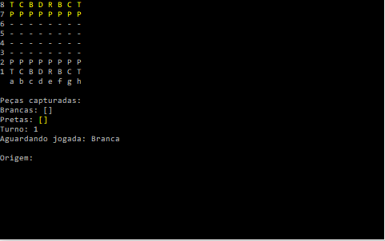

# Jogo de Xadrez Console

## Sobre o sistema
Esse jogo de xadrez no console, foi desenvolvido com a linguagem C#. Possui todos os mecanismos e regras de um jogo de xadrez tradicional. Para a construção desse programa, foi utilizado todos os conceitos de Orientação a objeto.

## Layout do jogo
</img>

Para jogar é bem simples, basta digitar a posição de origem da peça que deseja. Feito isso, o tabuleiro selecionara os campos que esse peça pode se mover. Depois só digitar a posição de destino para mover a peça no jogo.
Exemplo: Quero mover o cavalo da peça branca que esta com o sigla 'C', basta digitar "g1". Após isso, o tabuleiro selecionara os campos que o cavalo pode mover, no caso da imagem acima só podera mover para duas posições, "f4" ou "h4".

## Conceitos utilizados para desenvolver o jogo
- Classes abstratas
- Classes e métodos staticos
- Herança
- Polimorfismo
- Sobrecarga
- Comunicação de um objeto com outro
- Tratamento de Exceções